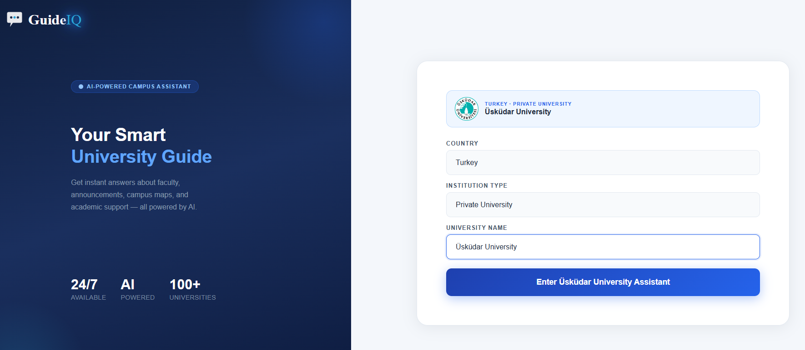
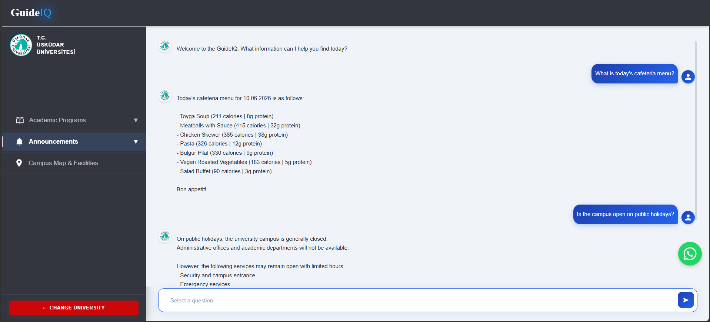
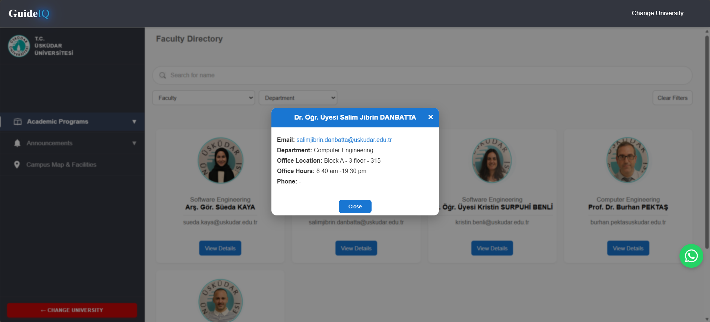
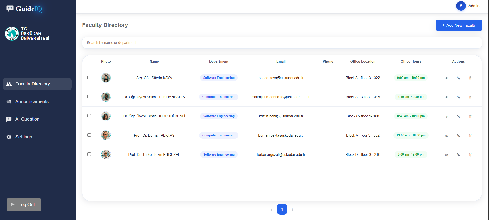
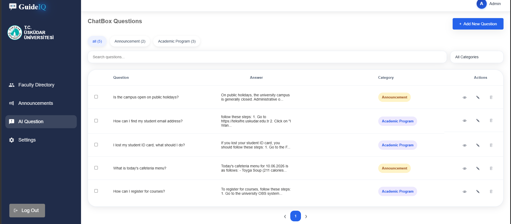
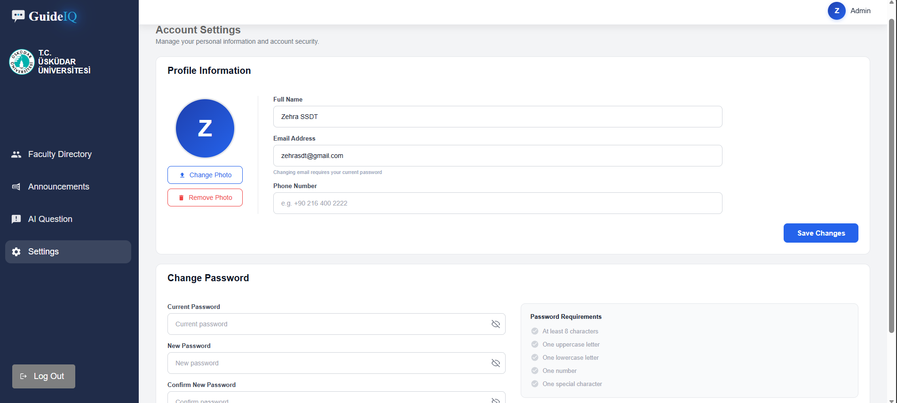
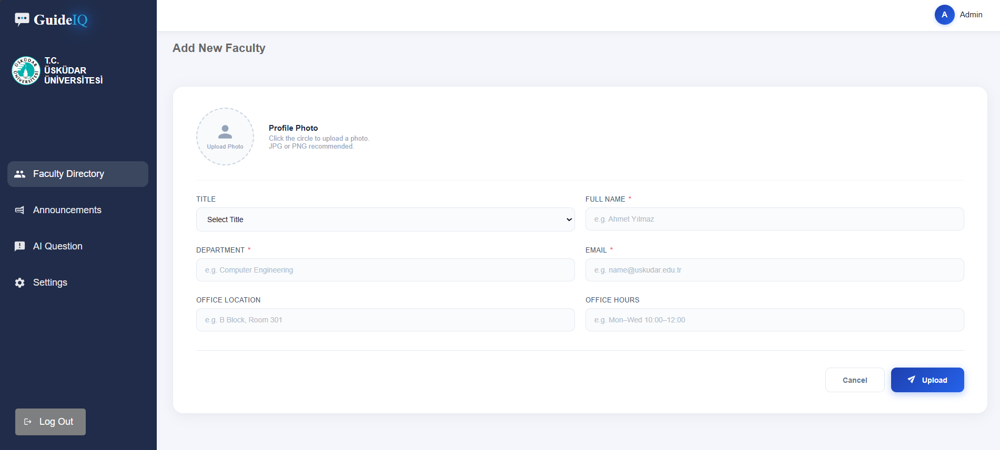

# GuideIQ

## Overview

GuideIQ is a full-stack university information platform designed to help students quickly access important campus information through an AI-powered chatbot, faculty directory, and university announcements.

The system provides separate interfaces for **students** and **administrators**. Students can chat with an AI assistant to get instant answers about academic programs and announcements, browse the faculty directory, and stay updated with the latest university news. Administrators have a dedicated dashboard to manage announcements, faculty members, and chatbot questions/answers in real time.

This project consists of a **React + Vite** frontend connected to a **Firebase** backend (Authentication & Firestore).

---

## Project Structure

GuideIQ/
│
├── src/
│   ├── components/      # Shared components (Sidebar, WhatsApp button, etc.)
│   ├── pages/
│   │   ├── dashboard/    # Admin dashboard pages
│   │   └── student/      # Student-facing pages
│   ├── firebase.js       # Firebase configuration
│   ├── App.jsx
│   └── main.jsx
│
├── public/
└── README.md


---

## Main Features

### Student Features

- Login & registration
- AI Academic & Announcement chatbots
- University announcements
- Faculty directory
- WhatsApp quick contact

### Admin Features

- Secure login & signup
- Manage announcements
- Manage faculty directory
- Manage chatbot questions
- Account settings (profile, password, photo)

---

## Technologies Used

### Frontend

- React
- JavaScript (JSX)
- Vite
- React Router
- HTML
- CSS

### Backend / Database

- Firebase Authentication
- Firebase Firestore (database)
- Firebase Storage

---

## Screenshots

### Login / Sign Up




### Student Chatbot





### Admin Dashboard








---

## Getting Started


### Prerequisites
- Node.js (v18 or higher recommended)

1. Clone the repository
```bash
git clone https://github.com/zehra2233/GuideIQQ.git
```

2. Install dependencies
```bash
npm install
```

3. Run the development server
```bash
npm run dev
```

The app will automatically connect to the shared Firebase backend, so all announcements, faculty, and questions added through the dashboard will be visible to anyone running the project.

---

## Author

**Zehra Sadat**